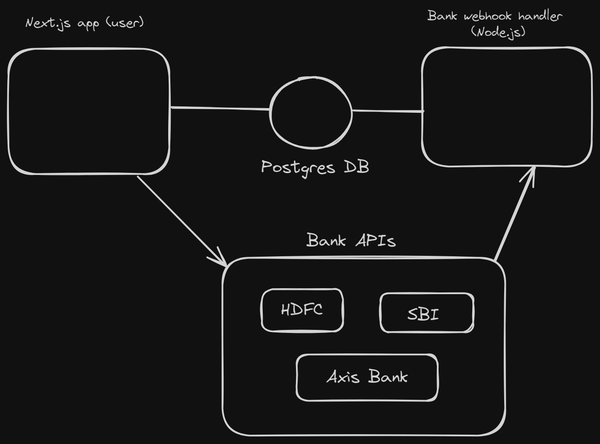

# PayConnect - Wallet App

## Features

- User friendly, online wallet system.
- Supports On ramp transactions, from the bank to the wallet
- Seperate Webhook handler server to support on ramp transactions.
- Transactions to/fromm other users are supported.

## Design



### Install Dependencies (frontend & backend)

```
npm install
Run postgres either locally or on the cloud (neon.tech)
```
### Create enviroment variables (.env) files
```
Copy over all .env.example files to .env (Check apps and packages folders for files)
Update .env files everywhere with the right db url
```
### Migrate Database and Generate Prisma Client
```
Go to `packages/db`
    - npx prisma migrate dev
    - npx prisma db seed
```

### Run

```
- Go to `apps/user-app` , run `npm run dev`
- Try logging in using phone - 1111111111 , password - alice (See `seed.ts`)

```

## ScreenShots


## Build & Deploy

```
# Create frontend prod build
cd client
npm run build
```
